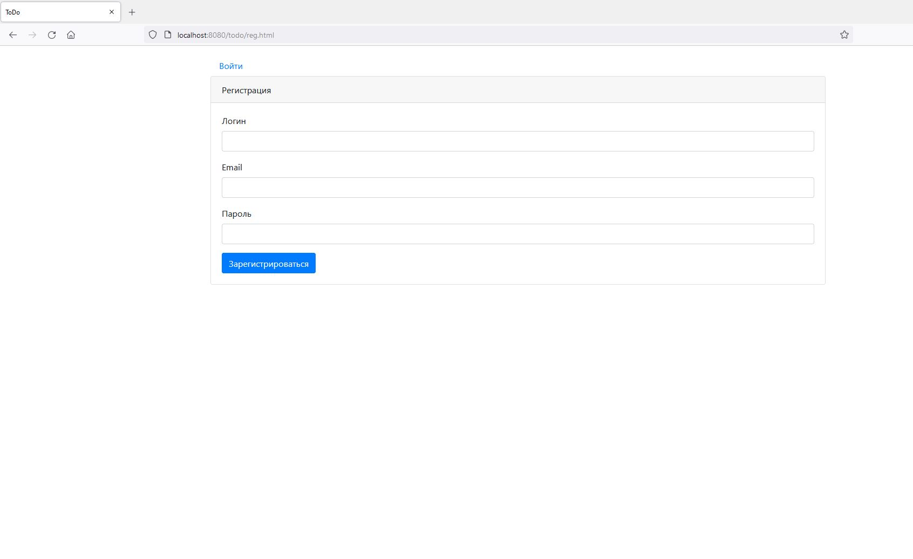

Приложение позволяет добавлять задачи, делать отметку об их выполнении, просматривать список всех выполненных и невыполненных задач.

Технологии
* Java 14
* PostgreSQL
* Hibernate
* HTML, BOOTSTRAP, JS, JQUERY, AJAX

